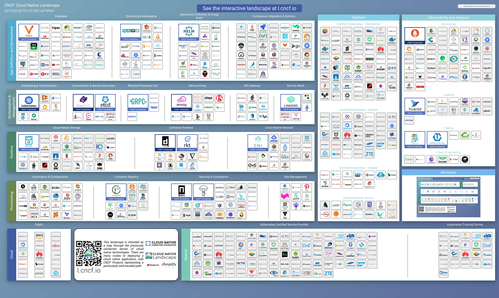

# 云原生指南 | 云原生最佳实践

## CNCF

## What is microservices

## 云原生（Cloud Native）

## 类别

我的分类：

* Kubernetes
* Openshift
* DevOps
* BigData
  * Spark
* Service Mesh
  * Istio
* Serverless
* MicroServices
* Database
  * MySQL
  * MongoDB
  * Redis
  * Hadoop
* AI
  * kubeflow
* HPC
* BlockChain
* Appendix
  * 学习资源
  * 国内镜像
* CNCF

---

* Database
  * Vitess
  * MySQL
  * MongoDB
  * Redis
  * Hadoop
  * Cassandra
* Streaming & Messaging
  * NATS
  * Kafka
  * spark
  * Flink
  * OpenMessaging
* Application Definition & Image Build
  * Helm
  * DRAFT
* Continuous Integration & Delivery
  * Jenkins
  * JenkinsX
  * GitLab
  * Spinnaker
* Cloud-Native Network
  * CNI
  * Calico
  * Open vSwitch
  * fannel
  * Contiv
* Container Runtime
  * containerd
  * rkd
  * cri-o
  * kata
  * runc
  * lxd
* Cloud-Native Storage
  * CSI
  * ROOK
  * GLUSTER
  * Ceph
  * OpenEBS
  * Swift
  * REX-Ray
* Scheduling & Orchestration
  * Kubernetes
  * Amazon ECS
  * Mesos
  * SWARM
  * Azure Service Fabirc
* Coordination & Service Discovery
  * CoreDNS
  * etcd
  * Zookeeper
  * Consul
  * Eureka
* Remote Procedure Call
  * GRPC
  * Apache Thrift
  * DUBBO
* Service Proxy
  * envoy
  * HAPROXY
  * NGINX
  * trafik
  * f5
  * openresty
* API Gateway
  * Kong
* Service Mesh
  * LINKERD
  * Istio
  * zuul

---

卡片分类：

* Cloud
  * Public
* Provisioning
  * Automation & Configuration
  * Container Registry
  * Security & Compliance
  * Key Management
* Runtime
  * Cloud-Native Storage
  * Container Runtime
  * Cloud-Native Network
* Orchestration & Management
  * Scheduling & Orchestration
  * Coordination & Service Discovery
  * Remote Proceduce Call
  * Service Proxy
  * API Gateway
  * Service Mesh
* App Definition and Development
  * Database
  * Streaming & Messaging
  * Application Definition & Image Build
  * Continuous Integration & Delivery
* Platform
  * Certified Kubernetes - Distribution
  * Certified Kubernetes - Host
  * Certified Kubernetes - Installer
  * PaaS/Container Service
* Serverless
  * Security
  * Tools
  * Framework
  * Hosted Platform
  * Installable Platform
* Observability and Analysis
  * Monitoring
  * Logging
  * Tracing
  * Chaos Engineering
* Special
  * Kubernetes Certified Service Provider
  * Kubernetes Training Partner

## 项目

### 毕业项目（Graduated Projects）

* Kubernetes
* Prometheus
* Envoy
* CoreDNS
* Containerd

### 孵化项目（Incubating Projects）

### 沙盒项目（Sandbox Projects）