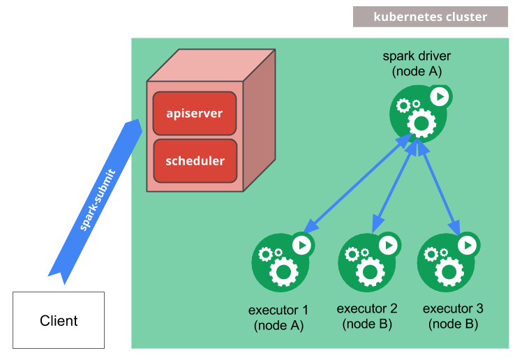

# Spark on Kubernetes

从 Spark 2.3.0 开始，Spark 原生支持运行在 Kubernetes 集群上。它使用了原生的 Kubernetes scheduler，该调度器已经被添加到了 Spark 中。

> 目前，内置到 Spark 的 Kubernetes scheduler 还是实验。未来版本中，配置、容器镜像、Entrypoint 都可能发生改变。

## 在线体验

* [Katacoda - 学习 Spark on Kubernetes](xxxxx)

## 前提条件

* Spark 版本 >= 2.3 （本教程基于 2.3.0）
* Kubernetes 集群版本 >= 1.6，且为 kubectl 配置了访问权限（本教程基于 1.8.2）
* 用户必须具有增删改查 Pod 的权限（使用 `kubectl auth can-i <list|create|edit|delete> pods` 命令进行验证）
* Driver Pod 所使用的 ServiceAccount 必须有权限创建 Pod、Service 和 ConfigMap
* Kubernetes 集群必须事先配置好 DNS

## 工作原理



## Kubernetes 环境

以下操作主要由 Kubernetes 管理员配置：

### 用户权限

* 认证用户身份

（略）

* 为用户授权

（略）

* 配置好后验证

```bash
namespace="yinxiaoqiang"

for action in "list" "create" "edit" "delete"; do
  kubectl auth can-i $action pods -n $namespace
done
```

### Spark Drvier Pod 权限

```bash
# 可以以用户名、团队名或者项目名作为命名空间，具体视情况而定
$ kubectl create namespace yinxiaoqiang

$ kubectl -n yinxiaoqiang create serviceaccount spark

# 绑定了系统内置的 "edit" ClusterRole，最好不要绑定 "admin" 或 "cluster-admin" ClusterRole，否则用户将有权限修改 ResourceQuota 和 LimitRange
$ kubectl create clusterrolebinding spark-on-k8s --clusterrole=edit --serviceaccount=yinxiaoqiang:spark

# 如果需要新增或修改授权，可以采用 YAML 方式
$ cat <<EOF | kubectl apply -f -
apiVersion: rbac.authorization.k8s.io/v1
kind: ClusterRoleBinding
metadata:
  name: spark-on-k8s
roleRef:
  group: rbac.authorization.k8s.io
  name: edit
  kind: ClusterRole
subjects:
- kind: ServiceAccount
  name: spark
  namespace: yinxiaoqiang
- kind: ServiceAccount # -_-
  name: spark # -_-
  namespace: zhangxiaolong # -_-
EOF
```

### 资源配额（可选）

管理员还应该对相应的命名空间设置资源配额（ResourceQuota），避免用户超额使用 Kubernetes 资源。

```bash
$ cat <<EOF | kubectl -n yinxiaoqiang apply -f -
apiVersion: v1
kind: ResourceQuota
metadata:
  name: quota
spec:
  hard:
    requests.cpu: "10"
    requests.memory: "10Gi"
    limits.cpu: "20"
    limits.memory: "20Gi"
    pods: "20"
EOF
```

对计算资源启用配额后，必须为 SparkConf 设置 `spark.kubernetes.driver.limit.cores` 和/或 `spark.kubernetes.executor.limit.cores`。

## 构建镜像

### 下载 Spark bin 客户端环境

```bash
$ spark/download-spark.sh 2.3.0
```

### 构建镜像

镜像还有个问题：需要设置 timezone。

构建一个测试镜像。

```bash
# 官方提供的这种方式有个缺点：没有办法改变镜像的项目名（默认是 "spark"），下面的方式打成的镜像为："dockerce/spark:2.3.0"
# bin/docker-image-tool.sh -r <repo> -t my-tag build
# bin/docker-image-tool.sh -r <repo> -t my-tag push

# 构建镜像并上传到 DockerHub
$ bin/docker-image-tool.sh -r docker.io/dockerce -t 2.3.0 build
$ bin/docker-image-tool.sh -r docker.io/dockerce -t 2.3.0 push

# 构建镜像并上传到 Quay
$ bin/docker-image-tool.sh -r quay.io/dockerce -t 2.3.0 build
$ bin/docker-image-tool.sh -r quay.io/dockerce -t 2.3.0 build
```

我的方式：

```bash
# 构建镜像并上传到 DockerHub
$ docker build -f kubernetes/dockerfiles/spark/Dockerfile -t dockerce/spark-on-k8s-example:2.3.0 . # tag 缺省了 "docker.io" registry
$ docker push dockerce/spark-on-k8s-example:2.3.0

# 构建镜像并上传到 Quay
$ docker build -f kubernetes/dockerfiles/spark/Dockerfile -t quay.io/dockerce/spark-on-k8s-example:2.3.0 .
$ docker push quay.io/dockerce/spark-on-k8s-example:2.3.0
```

### 分析 Dockerfile

```Dockerfile
FROM openjdk:8-alpine

ARG spark_jars=jars
ARG img_path=kubernetes/dockerfiles

RUN set -ex && \
    apk upgrade --no-cache && \
    apk add --no-cache bash tini libc6-compat && \
    mkdir -p /opt/spark && \
    mkdir -p /opt/spark/work-dir \
    touch /opt/spark/RELEASE && \
    rm /bin/sh && \
    ln -sv /bin/bash /bin/sh && \
    chgrp root /etc/passwd && chmod ug+rw /etc/passwd

COPY ${spark_jars} /opt/spark/jars
COPY bin /opt/spark/bin
COPY sbin /opt/spark/sbin
COPY conf /opt/spark/conf
COPY ${img_path}/spark/entrypoint.sh /opt/
COPY examples /opt/spark/examples
COPY data /opt/spark/data

ENV SPARK_HOME /opt/spark

WORKDIR /opt/spark/work-dir

ENTRYPOINT [ "/opt/entrypoint.sh" ]
```

## 运行 Spark 应用

### 提交应用程序

```bash
# 基本参数及配置
$ bin/spark-submit \
  --master k8s://https://192.168.10.99:8443 \
  --deploy-mode cluster \
  --name spark-pi \
  --class org.apache.spark.examples.SparkPi \
  --conf spark.executor.instances=5 \
  --conf spark.kubernetes.container.image=<spark-image> \
  local:///path/to/examples.jar # 这里指的是镜像中的本地路径，而不是客户端的本地路径
```

```bash
# Java & Scala 版本
$ bin/spark-submit \
  --master k8s://https://192.168.10.99:8443 \
  --deploy-mode cluster \
  --name spark-pi \
  --class org.apache.spark.examples.SparkPi \
  --conf spark.kubernetes.namespace=yinxiaoqiang \
  --conf spark.kubernetes.driver.limit.cores=3 \
  --conf spark.kubernetes.executor.limit.cores=2 \
  --conf spark.driver.memory=3g \
  --conf spark.driver.cores=3 \
  --conf spark.executor.memory=2g \
  --conf spark.executor.cores=2 \
  --conf spark.executor.instances=5 \
  --conf spark.kubernetes.container.image=dockerce/spark-on-k8s-example:2.3.0 \
  --conf spark.kubernetes.authenticate.driver.serviceAccountName=spark \
  local:///opt/spark/examples/jars/spark-examples_2.11-2.3.0.jar \
  100000
```

```bash
$ bin/spark-submit \
  --master k8s://https://192.168.10.99:8443 \
  --deploy-mode cluster \
  --name spark-pi \
  --conf spark.kubernetes.namespace=yinxiaoqiang \
  --conf spark.kubernetes.driver.limit.cores=3 \
  --conf spark.kubernetes.executor.limit.cores=2 \
  --conf spark.driver.memory=3g \
  --conf spark.driver.cores=3 \
  --conf spark.executor.memory=2g \
  --conf spark.executor.cores=2 \
  --conf spark.executor.instances=5 \
  --conf spark.kubernetes.container.image=dockerce/spark-on-k8s-example:2.3.0 \
  --conf spark.kubernetes.authenticate.driver.serviceAccountName=spark \
  local:///opt/spark/examples/src/main/python/pi.py \
  100000
```

参数说明：

* **spark.kubernetes.namespace**：Spark 应用程序要部署到的命名空间，它必须事先由管理员创建好
* **spark.executor.instances**：设置 Executor 的个数为 5 个
* **spark.kubernetes.driver.limit.cores**：设置 Driver Pod 的 `limits.cpu` 为 `3` 个核心，属性值必须是整数
* **spark.kubernetes.executor.limit.cores**：设置 Executor Pod 的 `limits.cpu` 为 `2` 个核心，属性值必须是整数
* **spark.driver.memory**：设置 Driver 进程所需的内存（参考值：1g，2345m；默认值：`1g`），即 Driver Pod 的 `requests.memory`；另外，`limits.memory` 会在该值基础上增加 384Mi（即 1g 的 37.5%）或者增加 10%
* **spark.driver.cores**：设置 Driver 进程所需的核数（参考值：2，1234m；默认值：`1`），即 Driver Pod 的 `requests.cpu`
* **spark.executor.memory**：设置 Executor 所需的内存（默认值：`1g`），即 Executor Pod 的 `requests.memory`；另外，`limits.memory` 会在该值基础上增加 384Mi（即 1g 的 37.5%）或者增加 10%
* **spark.executor.cores**：设置 Executor 所需的核数（默认值：`1`），即 Executor Pod 的 `requests.cpu`
* **local://**：镜像中 Spark 代码的绝对路径(`/opt/spark` 是 Spark 环境路径，取决于镜像是如何构建的)，并非客户端代码的路径；实际上，所有 `cluster` 模式都是不能加载本地代码的

具体步骤：

1. 任务提交后，Kubernetes 首先会自动创建 Driver Pod 和 Driver Service（Headless Service）；
2. 之后会自动创建一定数量的 Executor Pod，并开始执行任务；
3. 任务结束后会自动删除所有的 Executor Pod，但 Driver Pod 和 Driver Service 会被保留（Driver Pod 进入 `Completed` 状态）；
4. 客户端的 spark-submit 的进程终止。

> 目前，Spark 2.3.0 on Kubernetes 只支持 `cluster` 模式，且只支持部署 Java/Scala 语言的代码。

### Debug

```bash
$ kubectl -n yinxiaoqiang get pod
po/spark-pi-08a8d801c6dc36a4be648bb3b2e67553-driver   1/1       Running   0          1m        172.1.74.130   kube-node-100
po/spark-pi-08a8d801c6dc36a4be648bb3b2e67553-exec-1   1/1       Running   0          1m        172.1.199.54   kube-node-103
po/spark-pi-08a8d801c6dc36a4be648bb3b2e67553-exec-2   1/1       Running   0          1m        172.1.170.42   kube-node-120
po/spark-pi-08a8d801c6dc36a4be648bb3b2e67553-exec-3   1/1       Running   0          1m        172.1.170.27   kube-node-120
po/spark-pi-08a8d801c6dc36a4be648bb3b2e67553-exec-4   1/1       Running   0          1m        172.1.74.129   kube-node-100
po/spark-pi-08a8d801c6dc36a4be648bb3b2e67553-exec-5   1/1       Running   0          1m        172.1.74.138   kube-node-100

NAME                                                       TYPE        CLUSTER-IP   EXTERNAL-IP   PORT(S)             AGE       SELECTOR
svc/spark-pi-08a8d801c6dc36a4be648bb3b2e67553-driver-svc   ClusterIP   None         <none>        7078/TCP,7079/TCP   1m        spark-app-selector=spark-3c355942efd541e8bf4aff564781bf70,spark-role=driver
svc/spark-pi-9973bd4789a1377e926a15035e5d9d1a-driver-svc   ClusterIP   None         <none>        7078/TCP,7079/TCP   31m       spark-app-selector=spark-804223cd8b3241ecb49d36921eed372f,spark-role=driver

NAME                                                      ENDPOINTS                             AGE
ep/spark-pi-08a8d801c6dc36a4be648bb3b2e67553-driver-svc   172.1.74.130:7078,172.1.74.130:7079   1m
ep/spark-pi-9973bd4789a1377e926a15035e5d9d1a-driver-svc   <none>                                31m


$ kubectl -n yinxiaoqiang describe pod <spark-driver-pod>

$ kubectl -n yinxiaoqiang logs <spark-driver-pod>
```

### 查看 Driver UI 和 Driver 日志

```bash
# kubectl port-forward <driver-pod-name> 4040:4040

$ kubectl port-forward spark-pi-188486194dc539728201bb79b6d6582e-driver 4040:4040
```

## 分析原理

### 分析 Driver Pod

```bash
# 为了便于分析，我做了删减
$ kubectl -n yinxiaoqiang get po/spark-pi-05d273f298fc36228da46b27f1b7c9c8-driver -o yaml
apiVersion: v1
kind: Pod
metadata:
  annotations:
    spark-app-name: spark-pi
  labels:
    spark-app-selector: spark-0909fb34e01349a89b5a6e9c43eb76ec
    spark-role: driver
  name: spark-pi-05d273f298fc36228da46b27f1b7c9c8-driver
  namespace: yinxiaoqiang
spec:
  containers:
  - args:
    - driver
    env:
    - name: SPARK_DRIVER_MEMORY
      value: 1g
    - name: SPARK_DRIVER_CLASS
      value: org.apache.spark.examples.SparkPi
    - name: SPARK_DRIVER_ARGS
      value: "100000"
    - name: SPARK_DRIVER_BIND_ADDRESS
      valueFrom:
        fieldRef:
          apiVersion: v1
          fieldPath: status.podIP
    - name: SPARK_MOUNTED_CLASSPATH
      value: /opt/spark/examples/jars/spark-examples_2.11-2.3.0.jar:/opt/spark/examples/jars/spark-examples_2.11-2.3.0.jar
    - name: SPARK_JAVA_OPT_0
      value: -Dspark.app.name=spark-pi
    - name: SPARK_JAVA_OPT_1
      value: -Dspark.submit.deployMode=cluster
    - name: SPARK_JAVA_OPT_2
      value: -Dspark.driver.blockManager.port=7079
    - name: SPARK_JAVA_OPT_3
      value: -Dspark.kubernetes.container.image=dockerce/spark-on-k8s-example:2.3.0
    - name: SPARK_JAVA_OPT_4
      value: -Dspark.kubernetes.authenticate.driver.serviceAccountName=spark
    - name: SPARK_JAVA_OPT_5
      value: -Dspark.app.id=spark-0909fb34e01349a89b5a6e9c43eb76ec
    - name: SPARK_JAVA_OPT_6
      value: -Dspark.kubernetes.driver.pod.name=spark-pi-05d273f298fc36228da46b27f1b7c9c8-driver
    - name: SPARK_JAVA_OPT_7
      value: -Dspark.kubernetes.namespace=yinxiaoqiang
    - name: SPARK_JAVA_OPT_8
      value: -Dspark.driver.port=7078
    - name: SPARK_JAVA_OPT_9
      value: -Dspark.kubernetes.driver.limit.cores=3
    - name: SPARK_JAVA_OPT_10
      value: -Dspark.kubernetes.executor.podNamePrefix=spark-pi-05d273f298fc36228da46b27f1b7c9c8
    - name: SPARK_JAVA_OPT_11
      value: -Dspark.driver.host=spark-pi-05d273f298fc36228da46b27f1b7c9c8-driver-svc.yinxiaoqiang.svc
    - name: SPARK_JAVA_OPT_12
      value: -Dspark.executor.instances=5
    - name: SPARK_JAVA_OPT_13
      value: -Dspark.jars=/opt/spark/examples/jars/spark-examples_2.11-2.3.0.jar,/opt/spark/examples/jars/spark-examples_2.11-2.3.0.jar
    - name: SPARK_JAVA_OPT_14
      value: -Dspark.kubernetes.executor.limit.cores=2
    - name: SPARK_JAVA_OPT_15
      value: -Dspark.master=k8s://https://192.168.10.99:8443
    image: dockerce/spark-on-k8s-example:2.3.0
    name: spark-kubernetes-driver
    resources:
      limits:
        cpu: "3"
        memory: 1408Mi
      requests:
        cpu: "1"
        memory: 1Gi
  restartPolicy: Never
  serviceAccountName: spark
```

分析结果：

* Drvier Pod 使用 `SPARK_JAVA_OPT_` 开头的环境变量为 Spark Driver 传递 JVM 参数
* Driver Pod 的重启策略为 `Never`，意味着无论 Driver Pod 是否启动/运行正常，都不会重启（同时也不会被销毁，使用命令 `kubectl -n <namspace> get pod --show-all` 查看）；原因是目前 Spark on Kubernetes 集群方案还不支持 `spark.driver.supervise`（对应 spark-submit 的 `--supervise` 参数）
* Driver Pod 使用的是 `spark` ServiceAccount，所以可以推断 Driver Pod 维持着 Executor Pod 的生命周期：创建和销毁（垃圾回收除外）。

### 分析 Driver Service

```bash
$ kubectl -n yinxiaoqiang get svc
NAME                                                   TYPE        CLUSTER-IP   EXTERNAL-IP   PORT(S)             AGE
spark-pi-05d273f298fc36228da46b27f1b7c9c8-driver-svc   ClusterIP   None         <none>        7078/TCP,7079/TCP   28m
```

```bash
$ kubectl -n yinxiaoqiang get svc/spark-pi-05d273f298fc36228da46b27f1b7c9c8-driver-svc -o yaml
apiVersion: v1
kind: Service
metadata:
  name: spark-pi-05d273f298fc36228da46b27f1b7c9c8-driver-svc
  namespace: yinxiaoqiang
  ownerReferences:
  - apiVersion: v1
    controller: true
    kind: Pod
    name: spark-pi-05d273f298fc36228da46b27f1b7c9c8-driver
spec:
  clusterIP: None
  ports:
  - name: driver-rpc-port
    port: 7078
    protocol: TCP
    targetPort: 7078
  - name: blockmanager
    port: 7079
    protocol: TCP
    targetPort: 7079
  selector:
    spark-app-selector: spark-0909fb34e01349a89b5a6e9c43eb76ec
    spark-role: driver
  type: ClusterIP
```

分析结果如下：

* Kubernetes 为 Driver 创建的是一个 Headless Service，即没有 Cluster IP
* Driver Service 启用了[垃圾回收](xxxx.md)，它指向/依赖的是 Driver Pod，意味着如果删除 Driver Pod 的话，Service 会自动被回收
* Driver Service 关联了 Driver Pod 的两个端口：driver-rpc-port（7078）和 blockmanager（7079）

### 分析 Executor Pod

```bash
$ kubectl -n yinxiaoqiang get statefulset,pod
NAME                                                  READY     STATUS    RESTARTS   AGE
po/spark-pi-05d273f298fc36228da46b27f1b7c9c8-driver   1/1       Running   0          2m
po/spark-pi-05d273f298fc36228da46b27f1b7c9c8-exec-1   1/1       Running   0          2m
po/spark-pi-05d273f298fc36228da46b27f1b7c9c8-exec-2   1/1       Running   0          2m
po/spark-pi-05d273f298fc36228da46b27f1b7c9c8-exec-3   1/1       Running   0          2m
po/spark-pi-05d273f298fc36228da46b27f1b7c9c8-exec-4   1/1       Running   0          2m
po/spark-pi-05d273f298fc36228da46b27f1b7c9c8-exec-5   1/1       Running   0          2m
```

其中，Executor Pod 是按末尾的序号递增的，但这并不是使用 StatefulSet 来创建的。

```bash
# 为了便于分析，我删除了一些无关信息
$ kubectl -n yinxiaoqiang get po/spark-pi-05d273f298fc36228da46b27f1b7c9c8-exec-1 -o yaml
apiVersion: v1
kind: Pod
metadata:
  labels:
    spark-app-selector: spark-application-1524815587464
    spark-exec-id: "1"
    spark-role: executor
  name: spark-pi-05d273f298fc36228da46b27f1b7c9c8-exec-1
  namespace: yinxiaoqiang
  ownerReferences:
  - apiVersion: v1
    controller: true
    kind: Pod
    name: spark-pi-05d273f298fc36228da46b27f1b7c9c8-driver
    uid: ffe8b3e8-49ef-11e8-adc9-d4bed9b697fe
  resourceVersion: "348969813"
spec:
  containers:
  - args:
    - executor
    env:
    - name: SPARK_DRIVER_URL
      value: spark://CoarseGrainedScheduler@spark-pi-05d273f298fc36228da46b27f1b7c9c8-driver-svc.yinxiaoqiang.svc:7078
    - name: SPARK_EXECUTOR_CORES
      value: "1"
    - name: SPARK_EXECUTOR_MEMORY
      value: 1g
    - name: SPARK_APPLICATION_ID
      value: spark-application-1524815587464
    - name: SPARK_EXECUTOR_ID
      value: "1"
    - name: SPARK_MOUNTED_CLASSPATH
      value: /var/spark-data/spark-jars/*
    - name: SPARK_EXECUTOR_POD_IP
      valueFrom:
        fieldRef:
          apiVersion: v1
          fieldPath: status.podIP
    image: dockerce/spark-on-k8s-example:2.3.0
    imagePullPolicy: IfNotPresent
    name: executor
    ports:
    - containerPort: 7079
      name: blockmanager
      protocol: TCP
    resources:
      limits:
        cpu: "2"
        memory: 1408Mi
      requests:
        cpu: "1"
        memory: 1Gi
  restartPolicy: Never
  serviceAccountName: default
```

分析结果如下：

* Executor Pod 使用 `SPARK_DRIVER_URL` 环境变量与 Driver Pod 通信
* Spark Submit 设置的 `spark.kubernetes.executor.limit.cores`
* Executor Pod 使用的是 `default` ServiceAccount
* Executor Pod 启用了[垃圾回收](xxxx.md)，它指向/依赖的是 Driver Pod，意味着如果删除 Driver Pod 的话，Executor 会自动被回收

## 集成测试

* [Running the Kubernetes Integration Tests](https://github.com/apache-spark-on-k8s/spark-integration)

## 参考

* [Running Spark on Kubernetes](http://spark.apache.org/docs/2.3.0/running-on-kubernetes.html)
* [apache-spark-on-k8s - Running Spark on Kubernetes](https://apache-spark-on-k8s.github.io/userdocs/running-on-kubernetes.html)

> https://github.com/feiskyer/kubernetes-handbook/blob/master/zh/machine-learning/spark.md

https://banzaicloud.com/blog/pipeline-howto/

* [Introduction to Spark on Kubernetes](https://banzaicloud.github.io/blog/spark-k8s/)
