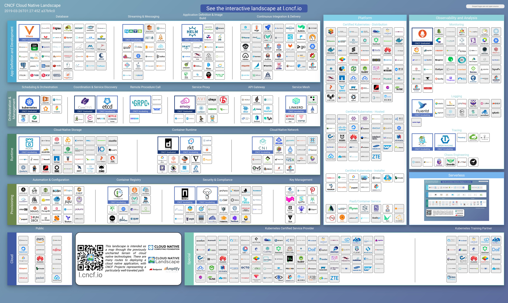

# Landscape

## 毕业项目（Graduated Projects）

    

        <a href="orchestration/kubernetes/README.md" class="link">
            
            
Orchestration · Kubernetes

        </a>
    

    

## 孵化项目（Incubating Projects）

## 沙盒项目（Sandbox Projects）

<!--
## Todo

* 使用 HTML 代替图片，并链接到相应项目
-->
