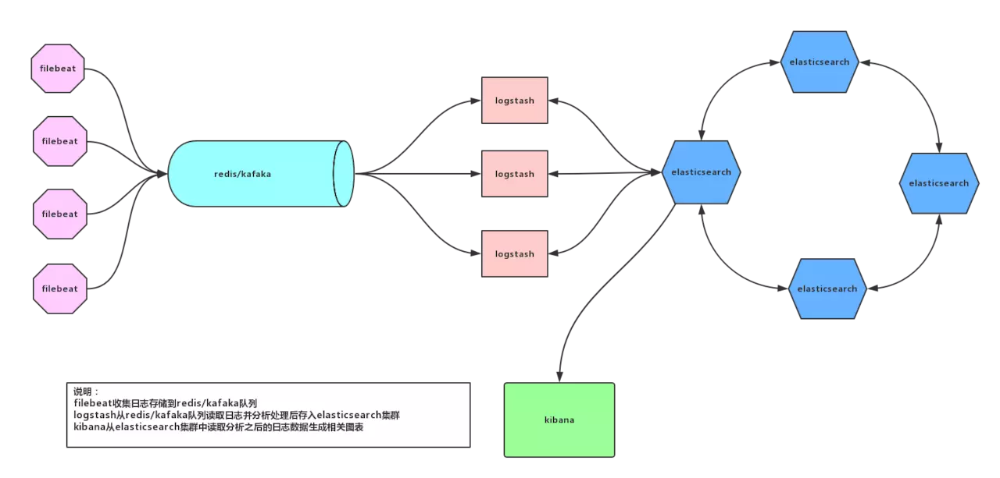
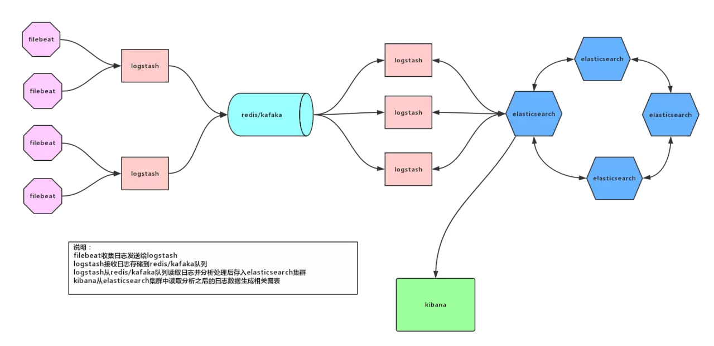

# 日志收集

## 通用日志收集方案

* 集群内相关组件日志使用 `fluentd/filebeat` 收集
* 应用输出到 stdout 或 stderr 的日志使用 `fluentd/filebeat` 收集
* 应用输出到容器中指定文件日志使用 `fluent-bit/filebeat` 收集

## 通用日志收集系统

架构说明：

* 日志收集与处理解耦
* 由于收集和处理过程间加入了队列，当日志出现暴增时，可以避免分析处理节点被打垮，给分析处理节点足够时间消化日志数据
* 日志分析处理节点可以动态伸缩

## 大流量日志收集系统

架构说明：

* 当日志流量过大时，如果每一个日志收集节点都直连队列写数据，由于有很多分散的连接及写请求，会给队列造成压力。如果日志都发送到logstash收集节点，再集中写入队列，会减轻队列压力。

## K8S 容器日志收集方案

应用打到docker stdout 前台输出，docker输出到/var/lib/containers, 通过filebeat、fluentd 、daemonsets组件收集，这种对于小量日志还可以，大量日志性能很差，写入很慢.
pod挂载host-path 把日志打到宿主机，宿主机启动filebeat， fluentd 、daemonsets 收集,无法判断来自哪个容器，pod namespaces。
pod的yml中定义两个 container ,同时启动一个附加的filebeat，两个container挂载一个共享卷来收集日志
我们用的第三种方案，通过一个附加容器filebeat来收集所有日志, filebeat–kakfa–logstash–es,自定义编译filebeat 镜相，为filebeat打上podip空间svc名等标签，方便识别来自哪个容器，哪个namespace，配置config-map以及yml。

## 参考

* [k8s 日志收集实战](https://juejin.im/post/5b6eaef96fb9a04fa25a0d37)
* [Kubernetes Logging Architecture](https://kubernetes.io/docs/concepts/cluster-administration/logging/)
* [Logging Agent For Elasticsearch](https://github.com/kubernetes/kubernetes/tree/release-1.6/cluster/addons/fluentd-elasticsearch)
* [spring-cloud on kubernetes 实践](https://blog.csdn.net/idea77/article/details/83446335)
