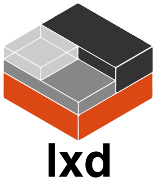

# 容器运行时

* CRI（Container Runtime Interface）
* OCI

## 定义

## CNCF 生态

    

        <a href="containerd/README.md" class="link">
            
            
CNCF Graduated

        </a>
    

    

        <a href="cri-o/README.md" class="link">
            
            
CNCF Incubating

        </a>
    

    

        <a href="rkt/README.md" class="link">
            
            
CNCF Incubating

        </a>
    

    

        
    

    

        
    

    

        
    

    

        
    

    

        
    

    

        
    

    

        
    

    

        
    

    

        
    

    

        
    

    

## Non-CNCF 生态

    

        <a href="~docker/README.md" class="link">
            
            
Non CNCF

        </a>
    

    

## 历史

Imctfy > libcontainer > RunC

## 容器 vs 虚拟机

* 容器比虚拟机更加透明，这有利于监控和管理

## Cgroup Drivers

<!--
When systemd is chosen as the init system for a Linux distribution, the init process generates and consumes a root control group (cgroup) and acts as a cgroup manager. Systemd has a tight integration with cgroups and will allocate cgroups per process. It’s possible to configure your container runtime and the kubelet to use cgroupfs. Using cgroupfs alongside systemd means that there will then be two different cgroup managers.

Control groups are used to constrain resources that are allocated to processes. A single cgroup manager will simplify the view of what resources are being allocated and will by default have a more consistent view of the available and in-use resources. When we have two managers we end up with two views of those resources. We have seen cases in the field where nodes that are configured to use cgroupfs for the kubelet and Docker, and systemd for the rest of the processes running on the node becomes unstable under resource pressure.

Changing the settings such that your container runtime and kubelet use systemd as the cgroup driver stabilized the system. Please note the native.cgroupdriver=systemd option in the Docker setup below.
-->

> Caution: Changing the cgroup driver of a Node that has joined a cluster is highly unrecommended. If the kubelet has created Pods using the semantics of one cgroup driver, changing the container runtime to another cgroup driver can cause errors when trying to re-create the PodSandbox for such existing Pods. Restarting the kubelet may not solve such errors. The recommendation is to drain the Node from its workloads, remove it from the cluster and re-join it.

## 参考

* [Container runtimes](https://kubernetes.io/docs/setup/production-environment/container-runtimes/)
